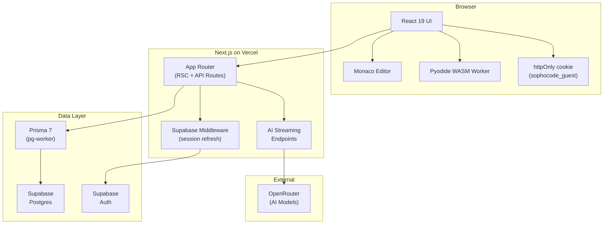

# Architecture

sophocode is a session-based Python algorithm practice platform with integrated AI coaching. Users work through curated problems, run Python in-browser via Pyodide (WASM), receive progressive AI hints that never spoil solutions, and track mastery through spaced repetition.

**Two guiding principles:** zero-friction entry (anonymous guests start immediately, no sign-up) and no server-side code execution (Python runs in-browser, eliminating sandbox complexity).

## Tech Stack

| Technology                 | Role                                                    |
| -------------------------- | ------------------------------------------------------- |
| Next.js 16 (App Router)    | Full-stack framework, RSC, API routes                   |
| React 19                   | UI runtime                                              |
| TypeScript (strict)        | Type safety                                             |
| Tailwind CSS v4            | Styling (`@theme` directive)                            |
| Prisma 7                   | ORM (`prisma.config.ts`, `@prisma/adapter-pg`)          |
| Supabase                   | Postgres + Auth (GitHub/Google OAuth)                   |
| Pyodide                    | In-browser Python via WASM (`public/pyodide-worker.js`) |
| Vercel AI SDK + OpenRouter | Streaming AI responses (model-agnostic)                 |
| Monaco Editor              | Code editor (dynamic import, `ssr: false`)              |
| Vitest + Playwright        | Unit + E2E testing                                      |
| Bun                        | Package manager + runtime                               |
| Changesets                 | Versioning + CHANGELOG                                  |
| GitHub Actions             | CI/CD (4 workflows)                                     |
| Vercel                     | Deployment                                              |

## Key Concepts

- **Guest-first auth** — anonymous identity via httpOnly cookie managed in `src/proxy.ts`.
- **Pyodide WASM** — Python runs in a Web Worker at `public/pyodide-worker.js`, wrapper at `src/lib/execution/runner.ts`.
- **Prisma 7 config** — DB URL in `prisma.config.ts` (not `schema.prisma`). Common gotcha.
- **Spaced repetition** — 4-state mastery machine: UNSEEN → IN_PROGRESS → MASTERED → NEEDS_REFRESH.
- **5 AI prompts** — explanation, hint (3-level), coach (Socratic), interviewer, summary. All enforce no-spoiler rules.
- **Component boundary** — `ui/` = pure primitives, `domain/` = feature components with data fetching.
- **60-30-10 color system** — 60% dark surface, 30% slate panels, 10% cyan accents.

## Detailed Documentation

| Document                                       | Contents                                                         |
| ---------------------------------------------- | ---------------------------------------------------------------- |
| [docs/ARCHITECTURE.md](docs/ARCHITECTURE.md)   | Full system design, data flows, Mermaid diagrams, tech rationale |
| [docs/AI-SYSTEM.md](docs/AI-SYSTEM.md)         | Prompt contexts, model config, streaming, graceful degradation   |
| [docs/DATABASE.md](docs/DATABASE.md)           | Prisma schema, all models/enums, seed data, migration notes      |
| [docs/DESIGN-SYSTEM.md](docs/DESIGN-SYSTEM.md) | Design tokens, color palette, typography, component architecture |
| [docs/SECURITY.md](docs/SECURITY.md)           | Security gaps, auth enforcement, rate limiting, mitigations      |
| [docs/ROADMAP.md](docs/ROADMAP.md)             | Post-MVP features, known limitations                             |

## CI/CD (4 Workflows)

| Workflow                | Trigger                 | Purpose                                           |
| ----------------------- | ----------------------- | ------------------------------------------------- |
| `ci.yml`                | PR + push to main       | Lint, typecheck, unit tests, E2E, changeset check |
| `release.yml`           | Push to main            | Auto-creates "Version Packages" PR via Changesets |
| `deploy-production.yml` | After CI passes on main | Vercel production deployment                      |
| `deploy-preview.yml`    | PR open/sync            | Vercel preview deployment + PR comment with URL   |

## Versioning

Changesets-based. Current package line is `0.2.x`. Every user-facing PR needs a changeset file. See [CONTRIBUTING.md](.github/CONTRIBUTING.md) for the workflow.
