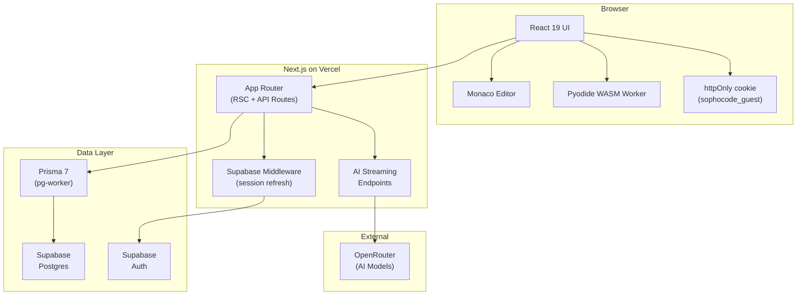
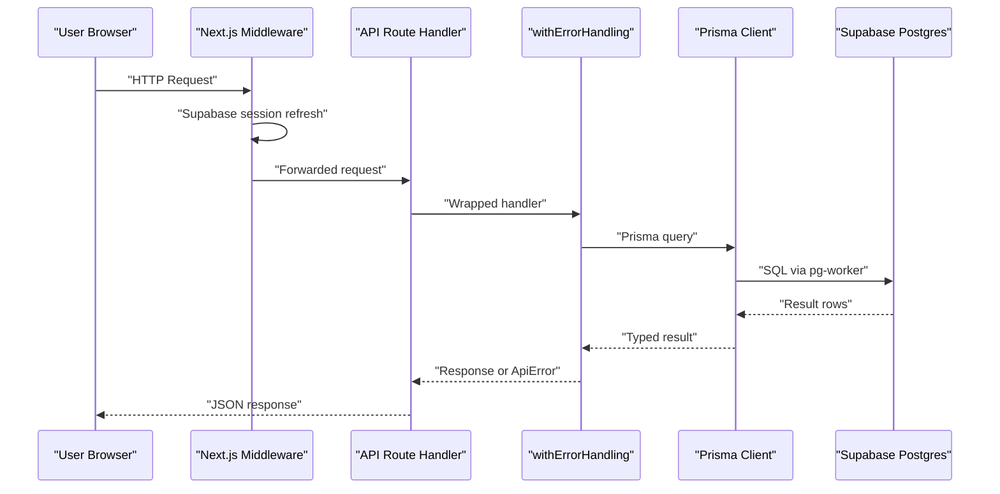
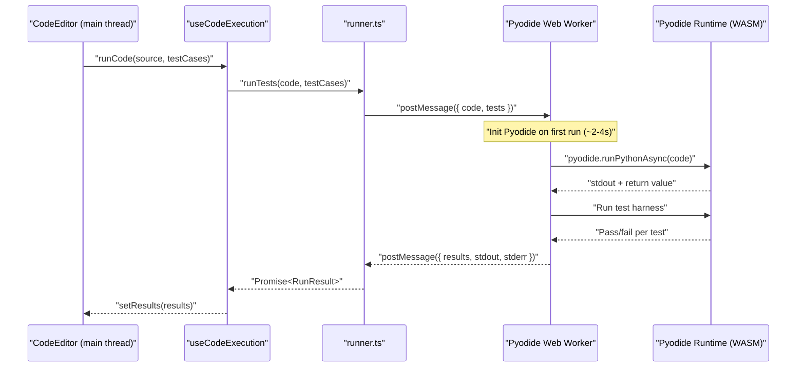
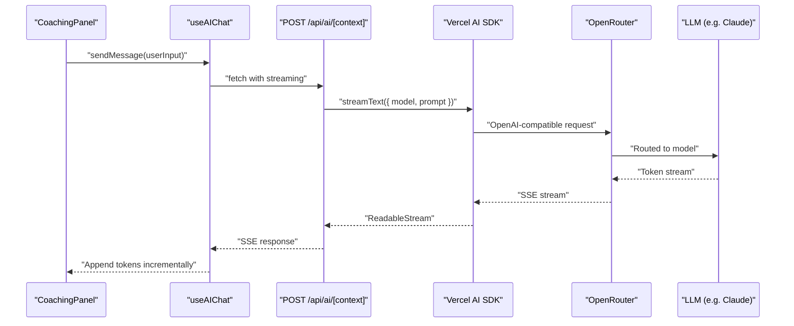
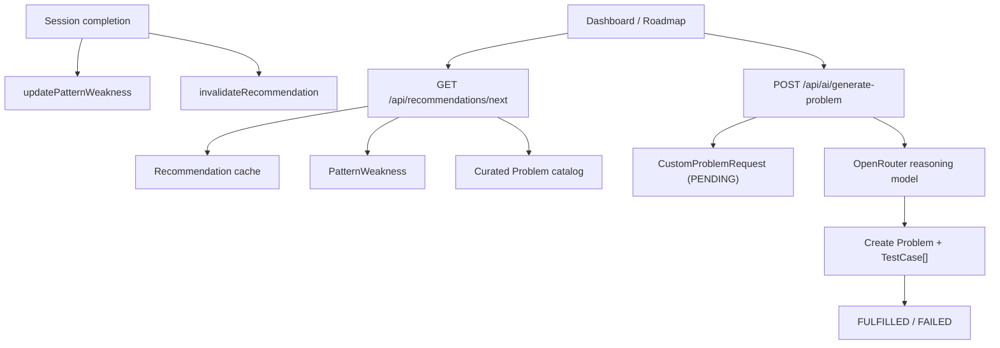
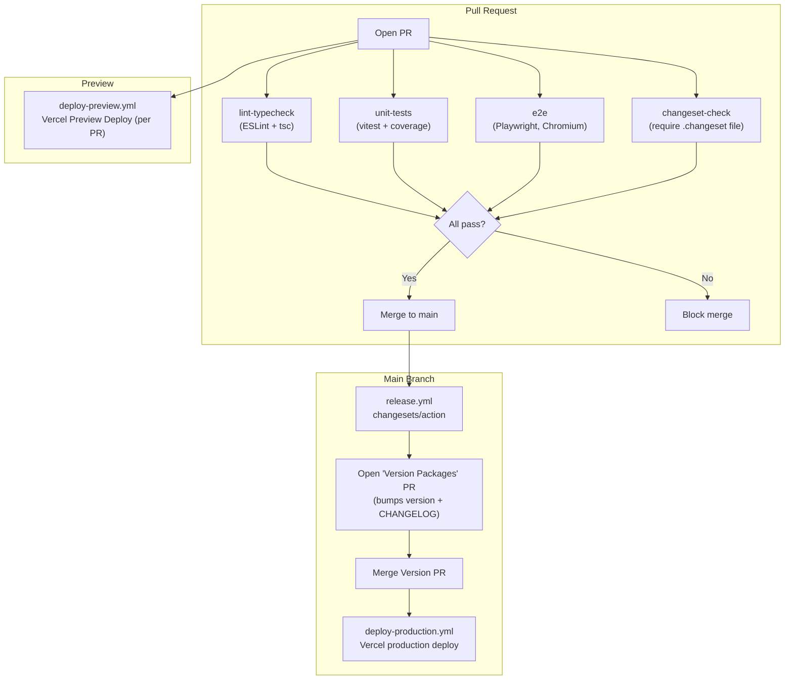
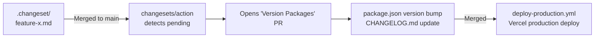

# Architecture — Full Reference

## Table of Contents

1. [System Overview](#1-system-overview)
2. [Tech Stack](#2-tech-stack)
3. [Directory Structure](#3-directory-structure)
4. [Core Concepts](#4-core-concepts)
5. [Data Flow](#5-data-flow)
6. [Authentication & Guest Flow](#6-authentication--guest-flow)
7. [AI Architecture](#7-ai-architecture)
8. [Testing Strategy](#8-testing-strategy)
9. [CI/CD Pipeline](#9-cicd-pipeline)
10. [Versioning & Releases](#10-versioning--releases)

---

## 1. System Overview

sophocode is a session-based Python algorithm practice platform with integrated AI coaching. Users work through curated algorithm problems inside a structured coding session — running Python code directly in the browser via WebAssembly, receiving AI hints that never spoil solutions, and accumulating a mastery score through spaced repetition.

The system is designed with two guiding principles: **zero-friction entry** (anonymous guests can start practicing immediately with no sign-up required) and **no server-side code execution** (Python runs in-browser via Pyodide, eliminating sandbox complexity and server cost). AI coaching is powered by OpenRouter (model-agnostic) with five specialized prompt contexts, and Wave 3 adds an adaptive loop (weak-pattern tracking + recommendations + custom generation) to close the practice-feedback cycle.



---

## 2. Tech Stack

| Technology               | Version | Role                              | Why                                                                                           |
| ------------------------ | ------- | --------------------------------- | --------------------------------------------------------------------------------------------- |
| **Next.js**              | 16.2.1  | Full-stack framework (App Router) | RSC, streaming, file-based routing, built-in API routes, Vercel-native deployment             |
| **React**                | 19      | UI runtime                        | RSC support, concurrent features, stable Actions API                                          |
| **TypeScript**           | strict  | Type safety across all layers     | Catches integration bugs at compile time; strict null checks enforced                         |
| **Tailwind CSS**         | v4      | Styling                           | `@theme` directive replaces config file; PostCSS-first pipeline; faster builds                |
| **Prisma**               | 7       | ORM / query builder               | Type-safe DB client; v7 `prisma.config.ts` + `@prisma/adapter-pg` for edge-compatible pooling |
| **Supabase**             | —       | Postgres host + Auth provider     | Managed Postgres with built-in OAuth (GitHub/Google); SSR-compatible auth helpers             |
| **Pyodide**              | latest  | In-browser Python runtime (WASM)  | Python execution with zero server infra; eliminates sandbox security surface                  |
| **Vercel AI SDK** (`ai`) | —       | Streaming AI responses            | Unified streaming primitives; works with any OpenRouter-compatible model                      |
| **OpenRouter**           | —       | AI model gateway                  | Model-agnostic; swap models without code changes; single API key                              |
| **Monaco Editor**        | —       | Code editor                       | VSCode's editor; Python syntax, keyboard shortcuts, familiar to developers                    |
| **Vitest**               | —       | Unit testing                      | Fast, ESM-native; jsdom environment for React component tests                                 |
| **Playwright**           | —       | E2E testing                       | Reliable cross-browser automation; Chromium-only in CI for speed                              |
| **Bun**                  | —       | Package manager + runtime         | Faster installs and script execution than npm/pnpm                                            |
| **Changesets**           | —       | Versioning + changelog            | Intentional, PR-level change tracking; auto-generates CHANGELOG.md                            |
| **GitHub Actions**       | —       | CI/CD                             | Lint, test, E2E, changeset enforcement, automated release PRs                                 |
| **Vercel**               | —       | Deployment                        | Zero-config Next.js deployment; edge middleware; preview deployments per PR                   |

---

## 3. Directory Structure

```
sophocode/
├── .github/
│   ├── workflows/
│   │   ├── ci.yml                 # Lint, typecheck, unit tests, E2E, changeset check
│   │   ├── release.yml            # Auto-creates "Version Packages" PR on main merge
│   │   ├── deploy-production.yml  # Vercel production deployment (after CI passes)
│   │   └── deploy-preview.yml     # Vercel preview deployment (per PR)
│   ├── CONTRIBUTING.md            # Contribution guide
│   └── pull_request_template.md   # PR template with changeset checkbox
├── .changeset/                    # Pending changeset files (one per PR)
├── docs/
│   ├── ARCHITECTURE.md            # Full architecture reference (this file)
│   ├── AI-SYSTEM.md               # AI prompt system and model config
│   ├── DATABASE.md                # Prisma schema, models, enums, migrations
│   ├── DESIGN-SYSTEM.md           # Design tokens, color system, components
│   ├── ROADMAP.md                 # Post-MVP roadmap
│   └── SECURITY.md                # Security gaps and mitigations
├── prisma/
│   └── schema/                    # Prisma schema files
├── prisma.config.ts               # Prisma v7 config (DB URL, adapter, output path)
├── public/
│   └── pyodide-worker.js          # Pyodide Web Worker (NOT in src/)
├── src/
│   ├── app/                       # Next.js App Router
│   │   ├── (auth)/                # Route group: /login, /auth/callback
│   │   ├── (marketing)/           # Route group: landing page
│   │   ├── api/
│   │   │   ├── sessions/          # Session CRUD, /complete, /hints, /snapshot
│   │   │   ├── problems/          # Problem listing and detail
│   │   │   ├── runs/              # Test run recording
│   │   │   ├── progress/          # User progress aggregation
│   │   │   └── ai/                # Streaming: /explain, /hint, /chat, /summary
│   │   ├── dashboard/             # Problem list + pattern heatmap
│   │   ├── onboarding/            # New user onboarding flow
│   │   ├── practice/              # Session practice UI
│   │   ├── progress/              # Progress visualization
│   │   └── session/               # Active coding session (Monaco + coach panel)
│   ├── components/
│   │   ├── ui/                    # Dumb primitives (no data fetching, no side effects)
│   │   │   ├── Button.tsx
│   │   │   ├── Badge.tsx
│   │   │   ├── Card.tsx
│   │   │   ├── Input.tsx
│   │   │   ├── Select.tsx
│   │   │   ├── Skeleton.tsx
│   │   │   ├── ErrorBoundary.tsx
│   │   │   ├── ErrorFallback.tsx
│   │   │   └── AIBanner.tsx
│   │   └── domain/                # Smart feature components (may fetch, may have side effects)
│   │       ├── ProblemList.tsx
│   │       ├── CoachingPanel.tsx
│   │       ├── SessionLayout.tsx
│   │       ├── CodeEditor.tsx     # Monaco wrapper (dynamic import, ssr: false)
│   │       ├── TestResults.tsx
│   │       ├── ProblemPanel.tsx
│   │       └── PatternHeatmap.tsx
│   ├── hooks/
│   │   ├── useUser.ts             # Auth state + user profile
│   │   ├── useSession.ts          # Session lifecycle + auto-save
│   │   ├── useCodeExecution.ts    # Pyodide run orchestration
│   │   ├── useAIChat.ts           # AI streaming chat state
│   │   ├── useKeyboardShortcuts.ts
│   │   └── useFloatingSophia.ts    # Behavioral nudges and avatar assistant cues
│   ├── lib/
│   │   ├── ai/
│   │   │   ├── provider.ts        # OpenRouter client config
│   │   │   ├── models.ts          # Model ID constants
│   │   │   └── prompts/           # Prompt builders per context
│   │   │       ├── explanation.ts
│   │   │       ├── hint.ts        # 3-level hints, no-spoiler enforced
│   │   │       ├── coach.ts       # Socratic questioning
│   │   │       ├── interviewer.ts
│   │   │       └── summary.ts
│   │   ├── auth/
│   │   │   └── migrate.ts         # Guest-to-user data migration helper
│   │   ├── db/
│   │   │   └── prisma.ts          # Prisma singleton
│   │   ├── errors/
│   │   │   └── api.ts             # handleApiError and API guard wrappers
│   │   ├── execution/
│   │   │   └── runner.ts          # Pyodide Worker interface wrapper
│   │   ├── supabase/
│   │   │   ├── client.ts          # Browser Supabase client
│   │   │   ├── server.ts          # Server Supabase client (RSC/API routes)
│   │   │   └── middleware.ts      # Session refresh helper
│   │   ├── mastery.ts             # State machine + spaced repetition logic
│   │   ├── guest.ts               # Guest cookie helpers
│   │   └── utils.ts               # cn() — clsx + tailwind-merge
│   ├── types/                     # Shared domain types
│   │   └── index.ts               # Problem, Session, MasteryState, etc.
│   └── proxy.ts                   # Next.js proxy — CSP, guest cookie, premium gating
├── tests/
│   └── e2e/                       # Playwright E2E specs
├── ARCHITECTURE.md                # Concise overview (links to docs/)
├── CHANGELOG.md                   # Auto-generated by Changesets
├── package.json
├── prisma.config.ts
├── playwright.config.ts
├── vitest.config.ts
└── tsconfig.json
```

---

## 4. Core Concepts

### 4.1 Guest-First Authentication

Users can start practicing immediately with no account required. A random guest ID is generated and set as an httpOnly cookie (`sophocode_guest`) in `src/proxy.ts`. API routes read guest identity server-side and associate sessions/progress with that guest ID.

When a user signs in (GitHub or Google OAuth via Supabase), `src/lib/auth/migrate.ts` currently migrates records with `userId = null` to the authenticated user. This behavior is not guest-cookie scoped yet and should be tightened in a follow-up.

**Why:** Removes the biggest drop-off point in practice tools — the sign-up wall. Users build momentum before being asked to commit.

---

### 4.2 Pyodide WASM for Python Execution

Python code runs entirely in the browser via [Pyodide](https://pyodide.org), a CPython port compiled to WebAssembly. The worker lives at `public/pyodide-worker.js` and is accessed through the `src/lib/execution/runner.ts` interface wrapper. Execution is isolated in a Web Worker so it never blocks the UI thread.

Pyodide is lazy-loaded (~20MB) on first run. Subsequent runs reuse the initialized runtime. stdout/stderr are captured and returned to the main thread alongside test results.

**Trade-offs:**

| Pro                                  | Con                                                |
| ------------------------------------ | -------------------------------------------------- |
| Zero server infra for execution      | ~20MB initial load                                 |
| No sandbox/escape risk               | Limited Python stdlib (no C extensions by default) |
| Instant feedback, no network latency | Cold start on first run (~2-4s)                    |
| Works offline after load             | Memory constrained by browser tab                  |

---

### 4.3 Prisma 7 with Supabase

Prisma v7 introduces a new configuration model. The database URL and adapter are configured in `prisma.config.ts` (not `schema.prisma`). The generated client is output to `src/generated/prisma/`.

For edge-compatible connection pooling, the stack uses `@prisma/adapter-pg` with `@prisma/pg-worker`. This allows the Prisma client to function correctly in Vercel's serverless and edge runtime environments without exhausting Postgres connection limits.

A singleton pattern in `src/lib/db/prisma.ts` prevents multiple Prisma client instances from being created during hot reloads in development.

```ts
// src/lib/db/prisma.ts — singleton pattern
const globalForPrisma = globalThis as unknown as { prisma: PrismaClient };
export const prisma = globalForPrisma.prisma ?? new PrismaClient();
if (process.env.NODE_ENV !== 'production') globalForPrisma.prisma = prisma;
```

---

### 4.4 Spaced Repetition Mastery System

Mastery state is computed in `src/lib/mastery.ts` using a deterministic state machine. Each problem per user has one of four states:

```
UNSEEN ──► IN_PROGRESS ──► MASTERED
                               │
                               └──► NEEDS_REFRESH (after 7 days)
                                         │
                                         └──► IN_PROGRESS (on revisit)
```

**Transition rules:**

| Event                      | From          | To            |
| -------------------------- | ------------- | ------------- |
| Session started            | UNSEEN        | IN_PROGRESS   |
| Solved with 0–1 hints      | IN_PROGRESS   | MASTERED      |
| Solved with 2+ hints       | IN_PROGRESS   | IN_PROGRESS   |
| Session completed unsolved | IN_PROGRESS   | IN_PROGRESS   |
| 7 days since MASTERED      | MASTERED      | NEEDS_REFRESH |
| Session started            | NEEDS_REFRESH | IN_PROGRESS   |

**Review intervals:** MASTERED → 7d, NEEDS_REFRESH → 3d, IN_PROGRESS → 1d.

The heatmap on the dashboard (`PatternHeatmap`) visualizes mastery across algorithm pattern categories (Two Pointers, Sliding Window, BFS/DFS, etc.).

---

### 4.5 Component Architecture: ui/ vs domain/

The component layer has a strict boundary:

| Layer                  | Location                 | Rules                                                                   |
| ---------------------- | ------------------------ | ----------------------------------------------------------------------- |
| **Primitives**         | `src/components/ui/`     | No data fetching. No side effects. Props-only. Fully reusable.          |
| **Feature components** | `src/components/domain/` | May fetch data. May have side effects. May use hooks. Problem-specific. |

This boundary keeps primitives stable and independently testable. Domain components compose primitives and add behavior.

---

### 4.6 Monaco Editor Integration

Monaco uses browser-only APIs and cannot be server-rendered. It must be imported via Next.js dynamic imports with `ssr: false`:

```ts
const CodeEditor = dynamic(() => import("@/components/domain/CodeEditor"), {
  ssr: false,
  loading: () => <Skeleton className="h-full" />,
})
```

The editor's `onChange` callback is debounced (typically 500ms) before triggering session auto-save via `useSession`. This prevents excessive API calls on every keystroke.

---

### 4.7 Tailwind v4 Theme System

Tailwind v4 removes `tailwind.config.ts`. Theme tokens are defined via the `@theme` directive directly in `globals.css`:

```css
@import 'tailwindcss';

@theme {
  --color-brand: oklch(65% 0.25 250);
  --color-surface: oklch(12% 0.02 250);
  /* ... */
}
```

The design follows a **60-30-10 color rule** for a consistent dark-first UI:

- **60%** — surface/background (neutral dark)
- **30%** — secondary elements (muted text, borders)
- **10%** — accent/brand (interactive elements, highlights)

---

## 5. Data Flow

### 5.1 Standard Request Flow



### 5.2 Python Execution Flow (Pyodide)



### 5.3 AI Streaming Flow



### 5.4 Adaptive Recommendation + Custom Generation Flow (Wave 3)



---

## 6. Authentication & Guest Flow

```mermaid
flowchart TD
    A["First Visit"] --> B{"sophocode_guest\ncookie exists?"}
    B -->|"No"| C["Generate guest ID\nSet httpOnly cookie"]
    B -->|"Yes"| D["Use existing guest cookie"]
    C --> D

    D --> E["Practice as Guest\n(sessions tied to UUID)"]
    E --> F{"User clicks\nSign Up?"}
    F -->|"No"| E
    F -->|"Yes"| G["Supabase OAuth\n(GitHub / Google)"]
    G --> H["OAuth Callback\n/auth/callback"]
    H --> I["migrate.ts\nLink guest activity to user"]
    I --> J["Authenticated Session\n(Supabase JWT cookie)"]
    J --> K["Continue practicing\n(all history preserved)"]

    style C fill:#1e293b,stroke:#475569
    style I fill:#1e293b,stroke:#475569
```



**Implementation details:**

- Guest identity is created/read in proxy + cookie helpers (`src/proxy.ts`, `src/lib/guest.ts`) and is not exposed to client JS.
- API routes check for an authenticated Supabase session first, falling back to the guest header. Records are stored with either a `userId` (authenticated) or `guestId` (anonymous).
- Migration helper lives at `src/lib/auth/migrate.ts` and runs server-side only.

---

## 7. AI Architecture

### 7.1 Prompt System

Five specialized prompt builders live in `src/lib/ai/prompts/`. Each enforces strict rules to prevent solution leakage:

| Context       | File             | Behavior                                                                                               |
| ------------- | ---------------- | ------------------------------------------------------------------------------------------------------ |
| `explanation` | `explanation.ts` | Teaches the underlying concept and pattern. Does not reference the specific problem solution.          |
| `hint`        | `hint.ts`        | 3-level progressive hints (direction → approach → specific). Never gives code that solves the problem. |
| `coach`       | `coach.ts`       | Socratic questioning. Responds with questions to guide the user's thinking.                            |
| `interviewer` | `interviewer.ts` | Simulates a technical interview. Asks follow-up questions, probes edge cases.                          |
| `summary`     | `summary.ts`     | Post-session debrief. Summarizes what went well, what to review, next steps.                           |

All prompts share a common system instruction: **"Do not provide a complete solution or code that directly solves the problem."**

Wave 3 additionally passes `sessionMode` through chat requests and applies `sanitizeCoachingContent` at render time in coaching/hint surfaces as a second safety layer.

### 7.2 Model Configuration

```ts
// src/lib/ai/provider.ts
import { createOpenAI } from '@ai-sdk/openai';

export const openrouter = createOpenAI({
  baseURL: 'https://openrouter.ai/api/v1',
  apiKey: process.env.OPENROUTER_API_KEY,
});
```

Model IDs are centralized in `src/lib/ai/models.ts`. The current configuration:

```ts
export const MODELS = {
  reasoning: 'stepfun/step-3.5-flash:free',
  summary: 'stepfun/step-3.5-flash:free',
} as const;
```

Swapping models requires changing a single constant, not touching prompt or streaming logic.

### 7.3 Streaming Architecture

API routes use `streamText` from the Vercel AI SDK and return a `StreamingTextResponse`. The client uses the SDK's `useChat` primitives (abstracted in `useAIChat`) to incrementally render tokens:

```ts
// src/app/api/ai/hint/route.ts
import { streamText } from 'ai';
import { openrouter } from '@/lib/ai/provider';
import { buildHintPrompt } from '@/lib/ai/prompts/hint';

export async function POST(req: Request) {
  const { problem, code, level } = await req.json();
  const result = streamText({
    model: openrouter('anthropic/claude-3.5-sonnet'),
    messages: buildHintPrompt({ problem, code, level }),
  });
  return result.toDataStreamResponse();
}
```

---

## 8. Testing Strategy

### 8.1 Unit Tests (Vitest)

**Location:** `src/**/__tests__/*.{test,spec}.{ts,tsx}`
**Environment:** jsdom (via `vitest.config.ts`)
**Libraries:** `@testing-library/react`, `@testing-library/user-event`

**What to unit test:**

- `src/lib/mastery.ts` — state machine transitions (pure functions, high value)
- `src/lib/guest.ts` — guest cookie generation/read helpers
- `src/lib/ai/prompts/` — prompt builder output (snapshot or string assertions)
- `src/lib/errors/` — error classification and response shaping
- `src/components/ui/` — primitive component rendering and prop behavior
- Custom hooks with mocked dependencies

**What NOT to unit test:**

- Domain components with complex data fetching (use E2E instead)
- Prisma queries directly (integration concern)
- Pyodide execution (covered by E2E)

**Coverage:** Unit tests run on every commit via `lint-staged`. CI enforces coverage artifact upload.

### 8.2 E2E Tests (Playwright)

**Location:** `tests/e2e/`
**Browser:** Chromium only (CI speed trade-off)
**Base URL:** `http://localhost:3000`

**What to E2E test:**

- Full guest flow: land → start session → run code → get hint → complete session
- Auth flow: sign up → data migration → authenticated session
- Dashboard: problem list renders, heatmap displays
- AI coaching panel: message sends, response streams

**Configuration:** `playwright.config.ts` sets 2 retries in CI, 0 in local dev.

### 8.3 Pre-Commit Hooks

`lint-staged` runs on every commit:

1. ESLint + Prettier on staged files
2. `vitest run` — full unit test suite (fast, no E2E)

This catches regressions before they reach CI.

### 8.4 CI Test Matrix

| Job               | Trigger           | What runs                                                   |
| ----------------- | ----------------- | ----------------------------------------------------------- |
| `lint-typecheck`  | PR + push to main | ESLint, Prettier check, `tsc --noEmit`                      |
| `unit-tests`      | PR + push to main | `vitest run --coverage`, uploads coverage artifact          |
| `e2e`             | PR + push to main | `playwright test`, Chromium only, 2 retries                 |
| `changeset-check` | PR only           | Fails if no `.changeset/*.md` and no `skip-changeset` label |

---

## 9. CI/CD Pipeline



**Workflow files:**

- `.github/workflows/ci.yml` — runs on `pull_request` and `push` to `main`. Jobs run in parallel where possible (`lint-typecheck`, `unit-tests`, `e2e` are independent). `changeset-check` runs only on `pull_request`.
- `.github/workflows/release.yml` — runs on `push` to `main`. Uses `changesets/action` to detect pending changesets and open a "Version Packages" PR automatically.
- `.github/workflows/deploy-production.yml` — triggers after CI passes on `main`. Pulls Vercel env vars, builds artifacts, and deploys to production via Vercel CLI.
- `.github/workflows/deploy-preview.yml` — triggers on PR open/sync. Builds and deploys a Vercel preview, then comments the URL on the PR.

---

## 10. Versioning & Releases

sophocode uses [Changesets](https://github.com/changesets/changesets) for intentional, PR-level version tracking.

### 10.1 Workflow for Contributors

Every PR that changes user-facing behavior must include a changeset file:

```bash
bun changeset
# Select change type: patch | minor | major
# Write a description of what changed
# Commit the generated .changeset/*.md file with your PR
```

PRs without a changeset file (and without the `skip-changeset` label) will fail the `changeset-check` CI job.

### 10.2 Release Cycle



### 10.3 Pre-release Mode

The project currently versions through standard Changesets release flow on the `0.2.x` line.

### 10.4 Change Types

| Type     | When to use                                        | Version bump               |
| -------- | -------------------------------------------------- | -------------------------- |
| `patch`  | Bug fixes, internal refactors, dependency updates  | `0.2.0` → `0.2.1`          |
| `minor`  | New features, new AI prompts, new problem patterns | `0.2.0` → `0.3.0`          |
| `major`  | Breaking API changes, auth model changes           | `0.2.0` → `1.0.0`          |
| _(none)_ | Docs, CI config, test-only changes                 | Use `skip-changeset` label |
